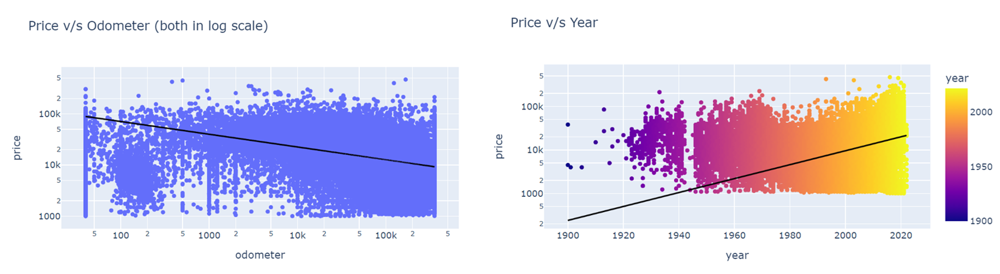
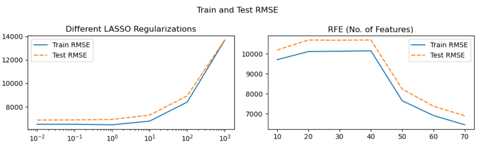

# Assignment 11.1 What drives the price of a used car?

## Overview
 In this project we looked at the dataset provided, which contains the prices for 426k used cars, to determine which factors are most important to determine the price of a used car. Based on the methods studied in class, so far, we try to build a variety of different linear models and try to determine the best model for predicting the price, using test data and cross-validation.

 In order to frame the task, and guide our research, we use the CRISP-DM framework which is a standard process in industry for data projects

## Business and Data Understanding
The first step was to determine the business goal of this project, which is to infer the drivers of price for a used car. Next, we familarize ourselves with the data provided. 

The dataset contains a lot of different features for the cars, such as the manufacturer and model of the car, the year of manufacture, odometer reading, condition, size, and so on. After cleaning the data, which involves removing observations with extreme data points, we explore the relationship of price with different variables. 

Looking at the charts below, we decide to build the model for logarithm of price, instead of the raw variable.

#### Few visualizations for relationship between features and prices
Odometer reading and the year of manufacture have a clear impact on the price of the used car.

Cars in *new* or *like-new* condtion are sold at a price higher than those in *fair* or *salvage* condition. Similarly, the drive of the car and engine types also impact the price.

## Data Processing
At this step, we prepare the data for building models.
* Custom and in-built transformers to process the data and perform feature engineering. For example, One-Hot Encoders, Target Encoders, Polynomial Features and so on.
* Custom imputer built upon the SimpleImputer functionality from sklearn

More details are provided in the [jupyter notebook](car_price_drivers.ipynb), but the following chart gives an overview of the data processing pipeline.

## Model and Evaluation

We split the data into a training (70%) and a test (30%) set and use RMSE as the error metric. Unlike MSE, it has the same scale as target variable and penalizes the larger errors more than MAE. 

We build a few different kinds of models, based on simple averages, target-encoding for model and manufacturer, and LASSO and RFE. For the latter two, we use 5-fold cross-validation to choose the hyperparameters. The lowest test RMSE is around $7000, using both RFE and LASSO.

 A curious thing to observe is that for both RFE and LASSO, the GrisSearchCV selects the models with the highest number of features and the lowest amount of regularization.There may be strong non-linearity in the model.
 
 

For the final inferential model, we use a polynomial degree of 2 and use LASSO with a regularization parameter of $\alpha = 0.01$.

## Conclusion and Next Steps
The manufacturer and model of the car, odometer reading, year of manufacture and the no. of cylinders seem to be the most imporant factors in determining the price of a used car.

FWD and 4WD cars are preferable to those with RWD, and diesel and gas engines are preferable to other fuel types.

 

**Two identical 2020 Chevroler Silverado 1500 have a price differential of $18k with a change in odometer reading**
  

### Next Steps
The linear models that we have explored in this project have been very helpful in drawing inference regarding which factors impact the car price the most. But if we want to build a more accurate model for the used car price, as a next step in the project, I would explore non-linear models such as decision trees.

## Link to Notebook
All these steps and results are further eloborated upon in the attached jupyter-notebook: [Notebook](car_price_drivers.ipynb)

